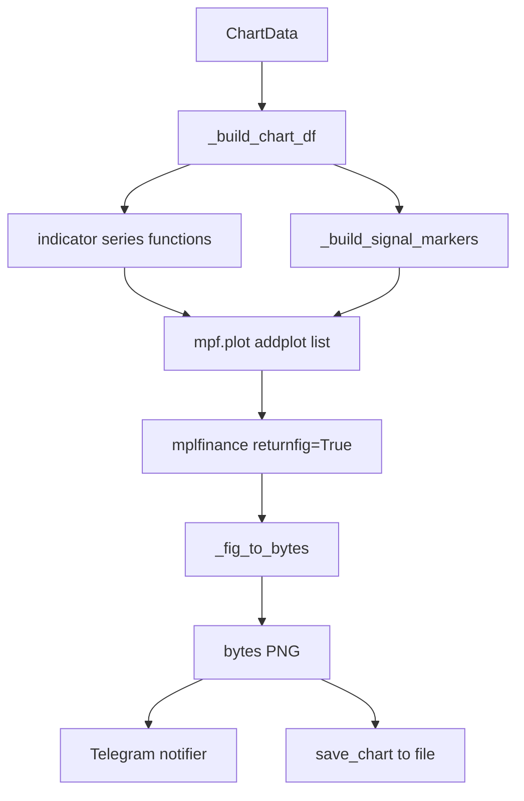

# Candle Chart Renderer Design

**Spec**: `.specs/features/candle-chart-renderer/spec.md`
**Status**: Draft

---

## Architecture Overview

Pipeline: `ChartData` → build windowed DataFrame → compute indicator series → build markers → render via `mplfinance` → PNG bytes.

Pure rendering — no I/O, no network, no state. Caller owns file write and Telegram send.



---

## Code Reuse Analysis

### Existing components

| Component | Location | How used |
|---|---|---|
| `Candle` | `src/fetcher/models.py` | OHLCV source data |
| `Signal` | `src/signals/models.py` | Direction + timestamp for marker |
| `SignalDirection` | `src/signals/models.py` | BUY/SELL/NO_SIGNAL branch |
| `IndicatorConfig` | `src/indicators/models.py` | Periods passed to series functions |
| `candles_to_df` | `src/indicators/utils.py` | Reused in new series functions |
| `InsufficientDataError` | `src/exceptions.py` | Raised when candles < required |

### New components

| Component | Location | Purpose |
|---|---|---|
| `calculate_rsi_series` | `src/indicators/rsi.py` | RSI for all candles → `pd.Series` |
| `calculate_sma_series` | `src/indicators/sma.py` | SMA for all candles → `pd.Series` |
| `calculate_supertrend_series` | `src/indicators/supertrend.py` | Full value + direction series |
| `ChartData` | `src/chart/models.py` | Input contract |
| `ChartConfig` | `src/chart/models.py` | `CHART_WINDOW` from env |
| `ChartRenderError` | `src/chart/exceptions.py` | Signal timestamp mismatch |
| `render_chart` | `src/chart/renderer.py` | Core rendering function |
| `save_chart` | `src/chart/file_writer.py` | Write PNG bytes to disk |

---

## Data Flow Detail

### Step 1 — Slice candle window

```python
window_candles = candles[-config.window:]   # last N, or all if fewer
df = candles_to_df(window_candles)          # DatetimeIndex DataFrame
```

`mplfinance` requires a DatetimeIndex DataFrame with columns `open`, `high`, `low`, `close`, `volume`. `candles_to_df` already produces exactly this.

### Step 2 — Compute indicator series

All series functions operate on `window_candles` and return `pd.Series` with the same DatetimeIndex as `df`. NaN fills the warmup period at the front.

```python
rsi       = calculate_rsi_series(window_candles, config.rsi_period)
sma_short = calculate_sma_series(window_candles, config.sma_short_period)
sma_long  = calculate_sma_series(window_candles, config.sma_long_period)
st_value, st_dir = calculate_supertrend_series(window_candles, ...)
```

### Step 3 — Split Supertrend by direction

Two series, each NaN where the other is active — renders as two colored lines that visually switch on trend change:

```python
st_bullish = st_value.where(st_dir == 1)   # NaN when BEARISH
st_bearish = st_value.where(st_dir == -1)  # NaN when BULLISH
```

### Step 4 — Build signal markers

`NaN` everywhere except the signal candle. Position slightly outside the wick so marker doesn't overlap:

```python
buy_markers  = pd.Series(float("nan"), index=df.index)
sell_markers = pd.Series(float("nan"), index=df.index)

if signal.direction == SignalDirection.BUY:
    buy_markers.loc[signal.timestamp] = df.loc[signal.timestamp, "high"] * 1.002
elif signal.direction == SignalDirection.SELL:
    sell_markers.loc[signal.timestamp] = df.loc[signal.timestamp, "low"] * 0.998
# NO_SIGNAL: both stay all-NaN — no markers rendered
```

Raises `ChartRenderError` if `signal.timestamp` not in `df.index`.

### Step 5 — Assemble addplots

```python
addplots = [
    mpf.make_addplot(sma_short, color="#f5a623", width=1.2),          # orange
    mpf.make_addplot(sma_long,  color="#4a9eff", width=1.2),          # blue
    mpf.make_addplot(st_bullish, color="#26a69a", width=1.5),         # green
    mpf.make_addplot(st_bearish, color="#ef5350", width=1.5),         # red
    mpf.make_addplot(rsi, panel=1, color="#b39ddb", ylabel="RSI",     # RSI sub-panel
                     secondary_y=False),
    mpf.make_addplot(pd.Series(50, index=df.index),                   # 50 reference
                     panel=1, color="#555555", linestyle="--", width=0.8),
    mpf.make_addplot(buy_markers,  type="scatter", markersize=120,
                     marker="^", color="#26a69a"),                     # green triangle up
    mpf.make_addplot(sell_markers, type="scatter", markersize=120,
                     marker="v", color="#ef5350"),                     # red triangle down
]
```

### Step 6 — Render and capture bytes

```python
fig, _ = mpf.plot(
    df,
    type="candle",
    style="nightclouds",     # built-in dark theme
    addplot=addplots,
    title=f"{signal.symbol} • {signal.timeframe} • {signal.direction.value.upper()}",
    panel_ratios=(3, 1),     # main:rsi height ratio
    returnfig=True,
    figsize=(14, 8),
    tight_layout=True,
)

buf = io.BytesIO()
fig.savefig(buf, format="png", dpi=100, bbox_inches="tight")
plt.close(fig)               # release memory
return buf.getvalue()
```

---

## New Indicator Series Functions

Thin wrappers — same validation as scalars, return full `pd.Series` instead of last value.

### `calculate_rsi_series`

```python
def calculate_rsi_series(candles: list[Candle], period: int = 14) -> pd.Series:
    if period <= 0:
        raise ValueError("period must be positive")
    if len(candles) < period + 1:
        raise InsufficientDataError(required=period + 1, got=len(candles))
    df = candles_to_df(candles)
    return ta.rsi(df["close"], length=period)
```

### `calculate_sma_series`

```python
def calculate_sma_series(candles: list[Candle], period: int = 20) -> pd.Series:
    if period <= 0:
        raise ValueError("period must be positive")
    if len(candles) < period:
        raise InsufficientDataError(required=period, got=len(candles))
    df = candles_to_df(candles)
    return ta.sma(df["close"], length=period)
```

### `calculate_supertrend_series`

```python
def calculate_supertrend_series(
    candles: list[Candle], period: int = 10, multiplier: float = 3.0
) -> tuple[pd.Series, pd.Series]:
    if period <= 0:
        raise ValueError("period must be positive")
    if len(candles) < period + 1:
        raise InsufficientDataError(required=period + 1, got=len(candles))
    df = candles_to_df(candles)
    result = ta.supertrend(df["high"], df["low"], df["close"], length=period, multiplier=multiplier)
    col_value = f"SUPERT_{period}_{multiplier}"
    col_dir   = f"SUPERTd_{period}_{multiplier}"
    return result[col_value], result[col_dir]
```

---

## Data Models

### `ChartData`

```python
from dataclasses import dataclass
from src.fetcher.models import Candle
from src.signals.models import Signal
from src.indicators.models import IndicatorConfig

@dataclass(frozen=True)
class ChartData:
    candles: list[Candle]
    signal: Signal
    config: IndicatorConfig = field(default_factory=IndicatorConfig)
```

### `ChartConfig`

```python
import os
from dataclasses import dataclass

@dataclass(frozen=True)
class ChartConfig:
    window: int = 100

    @classmethod
    def from_env(cls) -> "ChartConfig":
        return cls(window=int(os.getenv("CHART_WINDOW", "100")))
```

---

## File Structure

```
src/
├── indicators/
│   ├── rsi.py           # + calculate_rsi_series (new)
│   ├── sma.py           # + calculate_sma_series (new)
│   ├── supertrend.py    # + calculate_supertrend_series (new)
│   └── __init__.py      # export new series functions
└── chart/
    ├── __init__.py      # exports: render_chart, save_chart, ChartData
    ├── renderer.py      # render_chart(data, config?) -> bytes
    ├── file_writer.py   # save_chart(png: bytes, path: Path) -> None
    ├── models.py        # ChartData, ChartConfig
    └── exceptions.py    # ChartRenderError
```

---

## Error Handling

| Scenario | Behaviour |
|---|---|
| `candles` empty | `InsufficientDataError` from series functions |
| `len(candles) < sma_long_period` | `InsufficientDataError` from `calculate_sma_series` |
| `signal.timestamp` not in windowed df | `ChartRenderError("signal timestamp not in chart window")` |
| `signal.direction == NO_SIGNAL` | No marker — chart renders normally |
| `path.parent` not exist in `save_chart` | `FileNotFoundError` (not silenced) |

---

## Tech Decisions

| Decision | Choice | Rationale |
|---|---|---|
| Chart library | `mplfinance` | Purpose-built OHLCV rendering, addplot API, dark themes built-in |
| Output | `bytes` not file path | Caller decides destination (Telegram vs disk) — no coupling |
| Series functions | Added alongside scalars, same module | Reuse `candles_to_df`, no duplication, minimal change surface |
| `plt.close(fig)` | Always called | Prevents matplotlib memory leak in long-running process |
| Supertrend split | Two separate `addplot` series | Only way to render two colors on one logical line in mplfinance |
| Marker offset | `high * 1.002` / `low * 0.998` | Tiny %, scales with any price magnitude |
| `returnfig=True` | Yes | Avoids writing to disk inside renderer — pure bytes output |

---

## Integration with Telegram Notifier

Telegram notifier calls `render_chart(ChartData(...))` and attaches the returned bytes as a photo:

```python
# Inside notifier
png_bytes = render_chart(ChartData(candles=candles, signal=signal))
await bot.send_photo(chat_id=chat_id, photo=png_bytes)
```

No file temp path needed — Telegram Bot API accepts `bytes` directly.

---

## Integration with Standalone File Save

```python
from pathlib import Path
from src.chart import render_chart, save_chart

png = render_chart(ChartData(candles, signal))
save_chart(png, Path("charts") / f"{signal.symbol}_{signal.timestamp:%Y%m%d_%H%M}.png")
```
