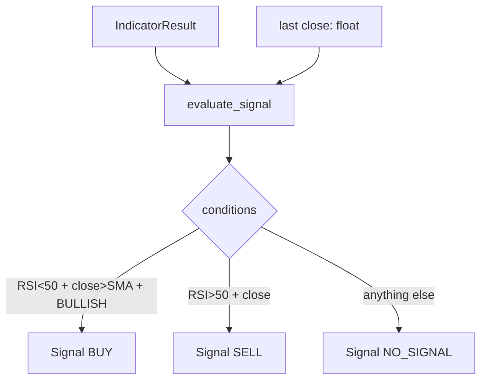

# Signal Generator Design

**Spec**: `.specs/features/signal-generator/spec.md`
**Status**: Draft

---

## Architecture Overview

Pure evaluation function: `IndicatorResult` + last close price → `Signal`.
No state, no I/O, no dependencies on exchange or pandas.



---

## Code Reuse Analysis

### Existing Components to Leverage

| Component | Location | How to Use |
|-----------|----------|------------|
| `IndicatorResult` | `src/indicators/models.py` | Input to evaluator |
| `TrendDirection` | `src/indicators/models.py` | Compare supertrend direction |
| `Candle` | `src/fetcher/models.py` | Extract `close` and `timestamp` |

### Integration Points

| System | Integration Method |
|--------|--------------------|
| Indicator Engine | Consumes `IndicatorResult` directly |
| Telegram Notifier (next) | Consumes `Signal` — stable output contract |

---

## Components

### SignalDirection (enum)

- **Purpose**: Typed direction value — BUY, SELL, NO_SIGNAL
- **Location**: `src/signals/models.py`

### Signal (frozen dataclass)

- **Purpose**: Full signal payload with direction + all context fields
- **Location**: `src/signals/models.py`

### evaluate_signal

- **Purpose**: Pure function — applies conditions, returns `Signal`
- **Location**: `src/signals/evaluator.py`
- **Interfaces**:
  - `evaluate_signal(indicators: IndicatorResult, candle: Candle) -> Signal`
- **Dependencies**: `IndicatorResult`, `TrendDirection`, `Candle`, `Signal`, `SignalDirection`
- **No side effects** — same inputs always produce same output

---

## Data Models

### SignalDirection

```python
from enum import Enum

class SignalDirection(Enum):
    BUY = "buy"
    SELL = "sell"
    NO_SIGNAL = "no_signal"
```

### Signal

```python
from dataclasses import dataclass
from datetime import datetime

@dataclass(frozen=True)
class Signal:
    symbol: str
    timeframe: str
    direction: SignalDirection
    close: float
    rsi: float
    sma: float
    supertrend_value: float
    supertrend_direction: str   # "bullish" or "bearish"
    timestamp: datetime
```

---

## File Structure

```
src/
└── signals/
    ├── __init__.py        # exports: evaluate_signal, Signal, SignalDirection
    ├── models.py          # Signal, SignalDirection
    └── evaluator.py       # evaluate_signal
```

---

## Evaluation Logic

```python
def evaluate_signal(indicators: IndicatorResult, candle: Candle) -> Signal:
    is_buy = (
        indicators.rsi < 50
        and candle.close > indicators.sma
        and indicators.supertrend.direction == TrendDirection.BULLISH
    )
    is_sell = (
        indicators.rsi > 50
        and candle.close < indicators.sma
        and indicators.supertrend.direction == TrendDirection.BEARISH
    )
    direction = SignalDirection.BUY if is_buy else SignalDirection.SELL if is_sell else SignalDirection.NO_SIGNAL
    return Signal(
        symbol=candle.symbol,
        timeframe=candle.timeframe,
        direction=direction,
        close=candle.close,
        rsi=indicators.rsi,
        sma=indicators.sma,
        supertrend_value=indicators.supertrend.value,
        supertrend_direction=indicators.supertrend.direction.value,
        timestamp=candle.timestamp,
    )
```

---

## Error Handling Strategy

| Error Scenario | Handling |
|---------------|----------|
| Invalid indicator values (NaN) | Not expected — `InsufficientDataError` raised upstream |
| All other input | Pure logic, no exceptions needed |

---

## Tech Decisions

| Decision | Choice | Rationale |
|----------|--------|-----------|
| Pure function | yes | No state needed — fully testable, no mocking required |
| Input: last `Candle` | use last candle from fetcher | Carries symbol, timeframe, close, timestamp in one object |
| Boundary | exclusive (< not <=) | RSI==50 and close==SMA are ambiguous — exclude both |
